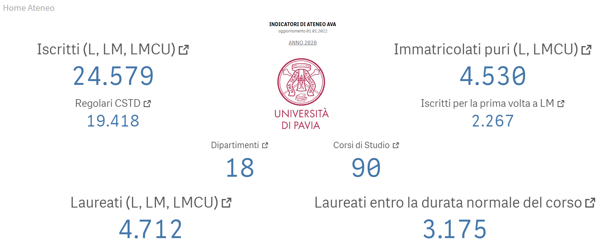
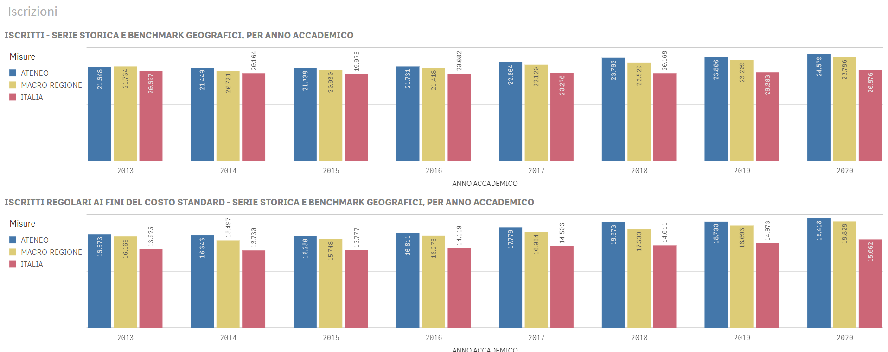
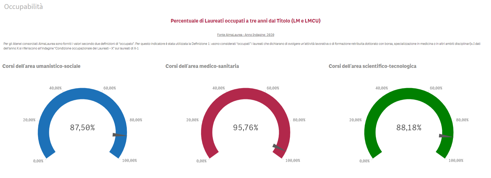
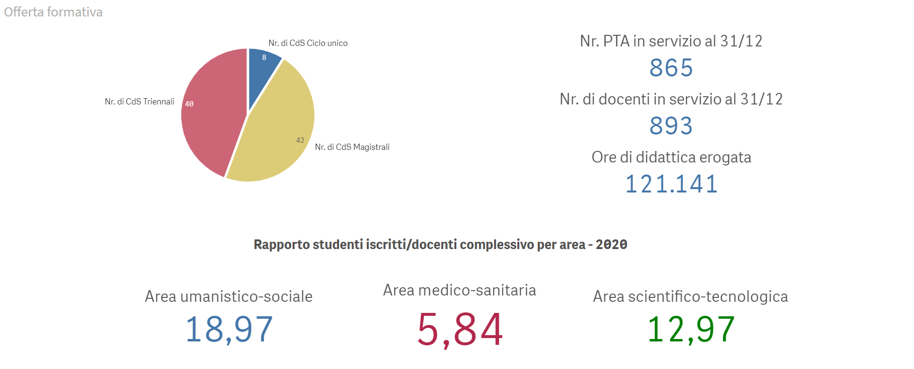

# 📊 University KPI Dashboard – Qlik Sense

## 🎯 Objective
Design an **executive-level Business Intelligence dashboard** to monitor key **University-wide performance indicators (AVA)**, supporting governance, strategic planning, and Quality Assurance activities.

The dashboard provides a consolidated view of:
- student population trends,
- enrollment dynamics,
- graduation outcomes,
- employability indicators,
- educational offer and staffing ratios.

---

## 🧰 Tool
- **Qlik Sense**

---

## 🏛️ Dashboard Overview – Institutional KPIs

This overview page presents the main institutional indicators, including:
- total enrolled students (Bachelor, Master, Single-cycle),
- first-time enrollments,
- regular students (cost standard definition),
- graduates and graduates within the nominal duration,
- number of departments and degree programs.

Designed for **top-level monitoring** and rapid situational awareness.

---

## 📈 Enrollment Trends & Benchmarking

Historical time series comparing:
- University-level enrollments,
- Macro-regional benchmarks,
- National averages.

The dashboard supports:
- trend analysis over academic years,
- benchmarking against external reference contexts,
- evaluation of institutional positioning.

---

## 🎓 Graduate Employability

Visualization of **employment rates three years after graduation** (Master and Single-cycle degrees), based on AlmaLaurea data.

Indicators are broken down by:
- Humanities & Social Sciences,
- Medical & Health Sciences,
- Scientific & Technological areas.

Useful for:
- monitoring post-graduation outcomes,
- assessing alignment between education and labor market.

---

## 🎯 Educational Offer & Staffing

This section focuses on:
- composition of the educational offer (Bachelor, Master, Single-cycle),
- number of academic staff and administrative personnel,
- total teaching hours delivered,
- student-to-faculty ratios by academic area.

Supports:
- resource allocation analysis,
- sustainability assessment of the educational offer,
- strategic planning.

---

## 🧠 Design Principles
- Executive-oriented layout
- Clear KPI hierarchy
- Strong use of benchmarking and contextual indicators
- Consistency with AVA and Quality Assurance frameworks
- High readability for non-technical stakeholders

---

## 🧩 Use Cases
- University governance and strategic planning
- Quality Assurance reporting (AVA indicators)
- Institutional performance monitoring
- Support to accreditation and evaluation processes

---

## ⚠️ Notes
Interactive Qlik Sense applications and underlying datasets are not publicly shared due to data confidentiality.  
The images represent finalized stakeholder-facing dashboard views.

---

## 📬 Author
**Andrea Sciarrillo**  
Data Analyst & Data Scientist  
📧 andreasciarrillo1998@gmail.com | [LinkedIn](https://linkedin.com/in/andrea598)

---

## 🏷️ License
MIT License © 2026 Andrea Sciarrillo
