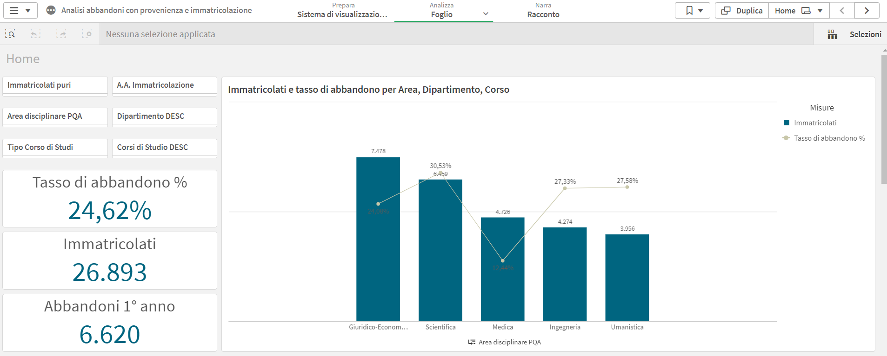
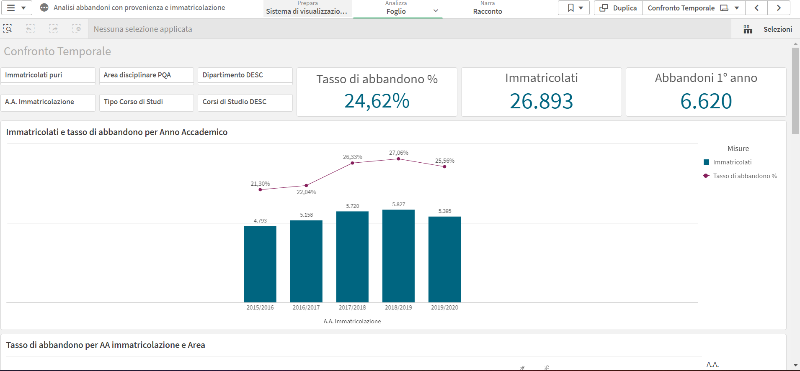
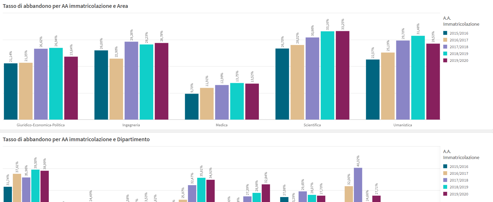
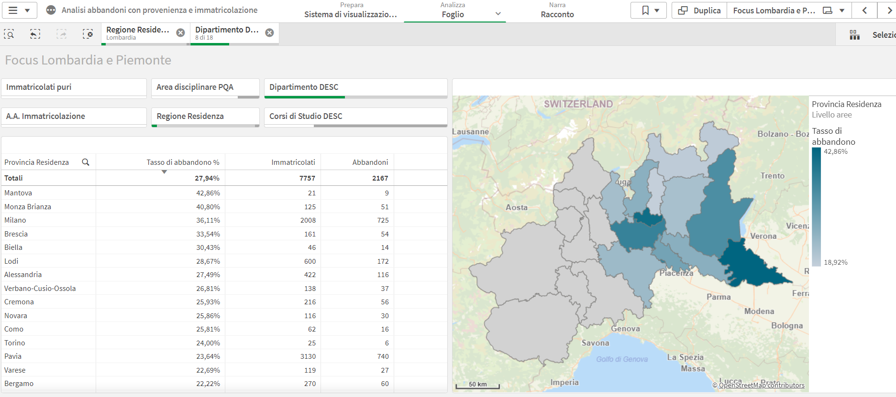
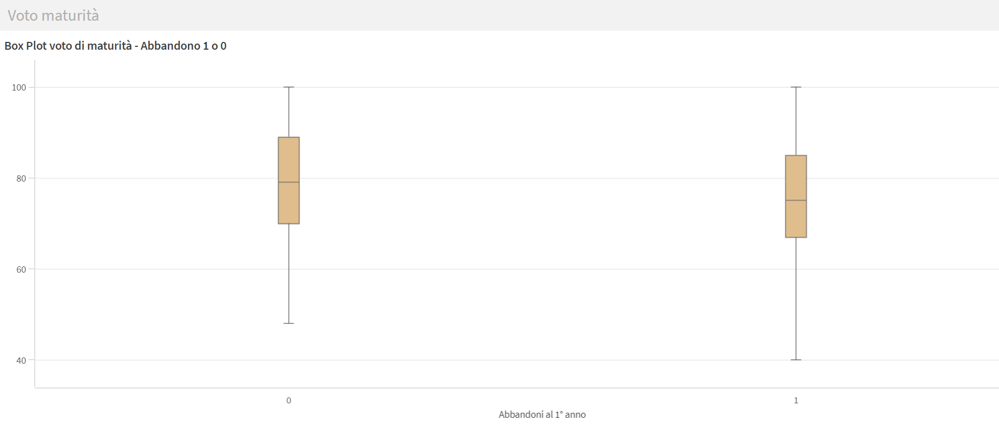
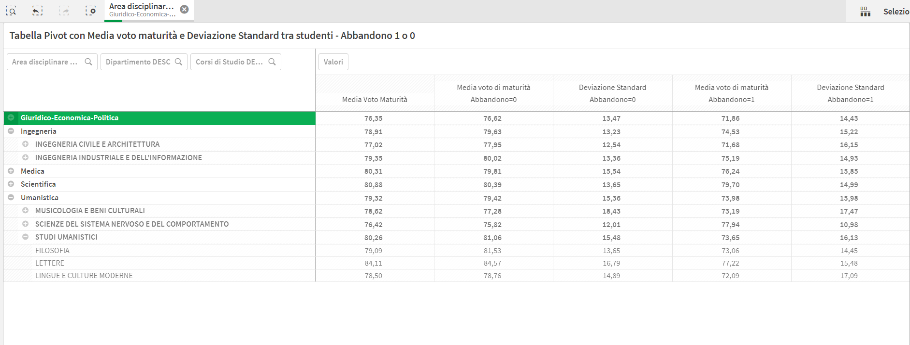

# 📉 Student Dropout Analysis Dashboard

## 🎯 Objective
Design an interactive **Business Intelligence dashboard** to analyze **first-year student dropout rates**, supporting institutional monitoring and strategic decision-making.

The dashboard enables multi-level analysis by:
- academic area,
- department,
- degree program,
- enrollment year,
- geographic origin of students.

---

## 🧰 Tool
- **Power BI**

---

## 📊 Dashboard Overview

### 🔹 Key Indicators (Overview)

- Total enrollments
- First-year dropouts
- Dropout rate (%)

These KPIs provide an immediate snapshot of the phenomenon at institutional level.

---

### 🔹 Dropout by Academic Area

Comparison of enrollments and dropout rates across academic areas  
(e.g. Scientific, Engineering, Humanities), highlighting structural differences.

---

### 🔹 Temporal Trends

Analysis of dropout rate evolution across enrollment cohorts, allowing:
- detection of worsening or improving trends,
- evaluation of policy impact over time.

---

### 🔹 Area × Time Comparison

Combined view of academic area and enrollment year, useful to:
- identify critical cohorts,
- distinguish structural vs cohort-specific effects.

---

### 🔹 Geographic Origin of Students

Spatial distribution of dropout rates by **region of residence**, revealing:
- territorial patterns,
- distance and mobility effects.

---

### 🔹 Regional Focus (Lombardy & Piedmont)

Zoomed analysis at **provincial level** for key feeder regions, supporting:
- targeted orientation and retention policies.

---

### 🔹 High School Grade Analysis

Box plot comparison of **high school final grades** between:
- students who dropped out,
- students who continued.

This view supports hypotheses on academic preparation and risk factors.

---

## 🧠 Design Principles
- Multi-level drill-down (area → department → degree program)
- Consistent KPI definitions
- Clear separation between volume (enrollments) and rate (dropout %)
- Focus on interpretability for non-technical stakeholders

---

## 🧩 Use Cases
- Institutional monitoring of student retention
- Support to Quality Assurance bodies
- Evidence base for orientation and tutoring interventions
- Exploratory analysis for predictive modeling design

---

## ⚠️ Notes
Interactive Power BI files and raw datasets are not publicly shared due to data confidentiality.  
Images represent stakeholder-facing dashboard views.

---

## 📬 Author
**Andrea Sciarrillo**  
Data Analyst & Data Scientist  
📧 andreasciarrillo1998@gmail.com | [LinkedIn](https://linkedin.com/in/andrea598)

---

## 🏷️ License
MIT License © 2026 Andrea Sciarrillo
