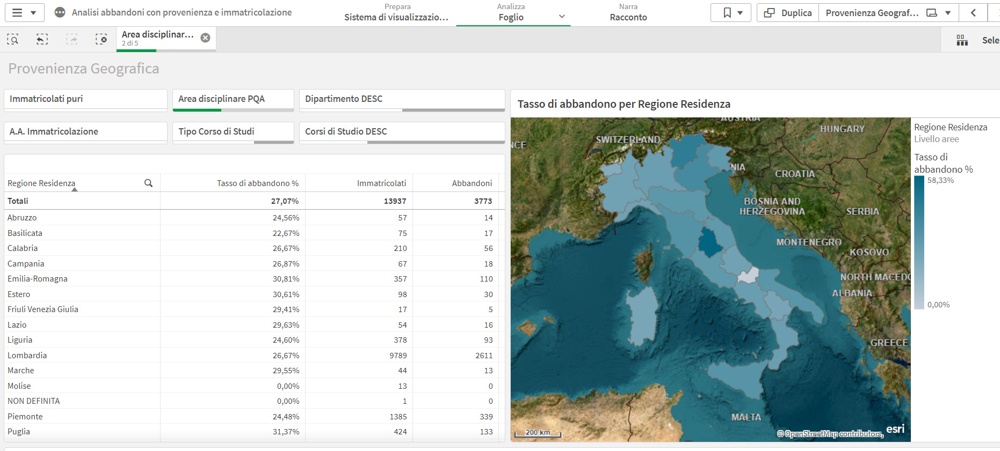

# 📉 Student Dropout Analysis Dashboard

## 🎯 Objective
Design a **Business Intelligence dashboard** to analyze **first-year student dropout rates**, supporting institutional monitoring and strategic decision-making within a university context.

The dashboard enables analysis by:
- academic area,
- department and degree program,
- enrollment cohort,
- geographic origin of students,
- prior academic background.

---

## 🧰 Tool
- **Power BI**

---

## 📊 Dashboard Overview

### 🔹 Key Indicators & Temporal Trend

This view provides a high-level snapshot of:
- total enrollments,
- first-year dropouts,
- overall dropout rate,
- temporal evolution across enrollment cohorts.

---

### 🔹 Dropout Rate by Academic Area and Year

Comparative bar charts showing dropout rates by:
- academic area,
- enrollment year.

This visualization highlights structural differences across disciplines and cohort-specific dynamics.

---

### 🔹 Geographic Origin of Students

Spatial distribution of dropout rates by **region of residence**, allowing:
- identification of territorial patterns,
- analysis of potential mobility or distance effects.

---

### 🔹 Academic Background Analysis

Box plot comparison of **high school final grades** between:
- students who dropped out in the first year,
- students who continued their studies.

This analysis supports hypotheses on academic preparation as a risk factor.

---

### 🔹 Descriptive Statistics by Academic Area

Pivot table summarizing:
- mean high school grade,
- standard deviation,
- comparison between dropout and non-dropout students.

Useful for exploratory analysis and feature assessment.

---

## 🧠 Design Principles
- Multi-level aggregation (area → department → degree program)
- Clear separation between volume indicators and rates
- Emphasis on interpretability for non-technical stakeholders
- Alignment with Quality Assurance monitoring needs

---

## 🧩 Use Cases
- Institutional monitoring of student retention
- Support to Quality Assurance and governance bodies
- Evidence base for orientation, tutoring, and support policies
- Exploratory groundwork for predictive modeling initiatives

---

## ⚠️ Notes
Interactive Power BI files and raw datasets are not publicly shared due to data confidentiality.  
The images represent stakeholder-facing dashboard views.

---

## 📬 Author
**Andrea Sciarrillo**  
Data Analyst & Data Scientist  
📧 andreasciarrillo1998@gmail.com | [LinkedIn](https://linkedin.com/in/andrea598)

---

## 🏷️ License
MIT License © 2026 Andrea Sciarrillo
