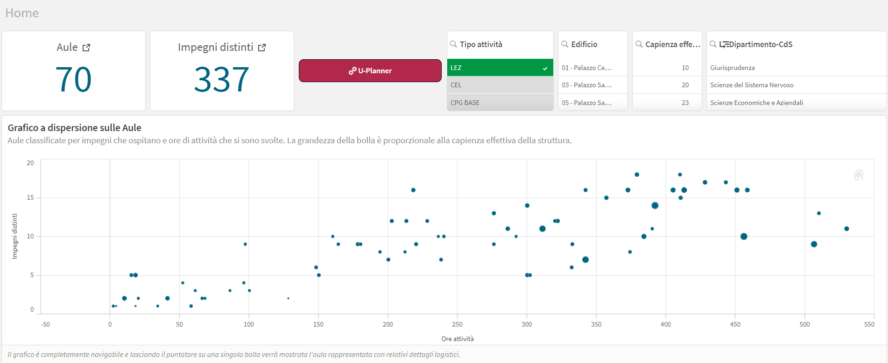
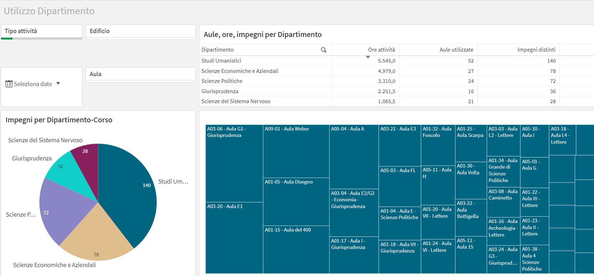
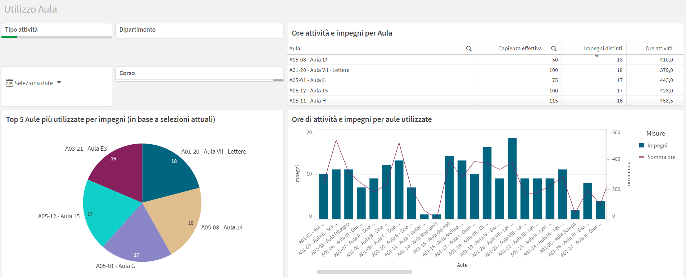
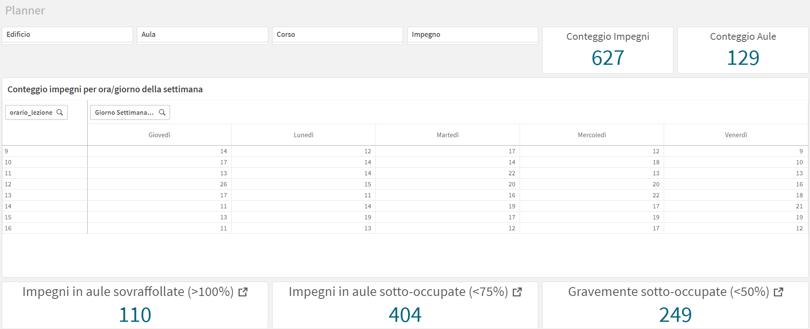
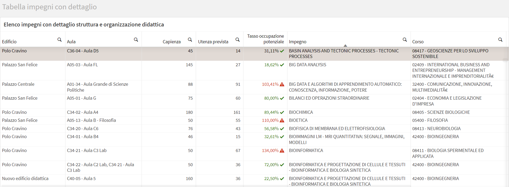
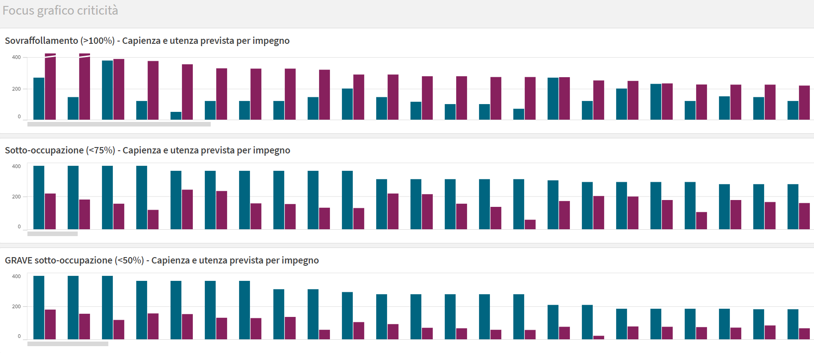
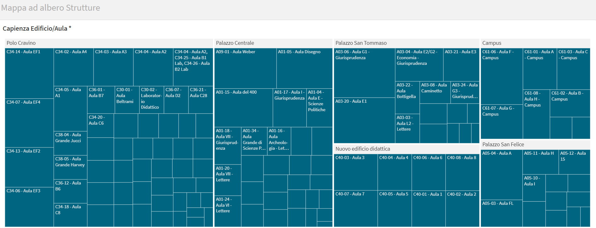

# 🏫 Classroom Utilization & Lesson Planning Dashboard  
**Qlik Sense – University Logistics Decision Support**

## 🎯 Objective
Design and develop an **interactive Business Intelligence dashboard** to support the **University logistics office** in planning and optimizing **classroom usage**, based on:

- classroom capacity,
- expected student attendance,
- actual teaching load,
- temporal distribution of lessons.

The dashboard supports evidence-based decisions to:
- reduce overcrowding,
- detect under-utilized classrooms,
- improve lesson scheduling efficiency.

---

## 🧰 Tool
- **Qlik Sense**

---

## 📊 Dashboard Overview

### 🔹 Home – Global KPIs

High-level indicators providing an immediate overview of the teaching logistics system:
- Total number of classrooms
- Distinct teaching commitments
- Quick access to the university planning system (U-Planner)

Interactive filters allow selection by:
- activity type,
- building,
- effective classroom capacity,
- department / degree program.

---

### 🔹 Classroom Utilization – Scatter Analysis

Bubble chart showing:
- **hours of activity** (x-axis),
- **distinct teaching commitments** (y-axis),
- **bubble size proportional to classroom capacity**.

Useful to identify:
- heavily used vs marginal classrooms,
- capacity mismatches.

---

### 🔹 Department-Level Utilization

Analysis of classroom usage by department, including:
- total teaching hours,
- classrooms used,
- distinct commitments.

Includes:
- pie chart by department,
- treemap of classrooms by building and department.

---

### 🔹 Classroom-Level Detail

Detailed classroom analysis:
- effective capacity,
- number of scheduled activities,
- total hours delivered.

Highlights:
- Top 5 most-used classrooms,
- relationship between commitments and hours.

---

### 🔹 Temporal Planner

Time-based view of teaching commitments:
- distribution by **day of the week** and **hour**,
- identification of congestion peaks.

Key KPIs:
- total scheduled commitments,
- number of classrooms involved.

---

### 🔹 Occupancy Risk Monitoring

Dedicated views to identify critical conditions:
- **Overcrowded classrooms** (>100% capacity),
- **Under-utilized classrooms** (<75%),
- **Severely under-utilized classrooms** (<50%).

Supports corrective and preventive planning actions.

---

### 🔹 Structural Capacity Map

Tree map representation of:
- buildings → classrooms,
- relative classroom capacity.

Useful for:
- spatial planning,
- infrastructure assessment.

---

## 🧠 Design Principles
- Decision-oriented BI
- Strong interactivity through filters
- Clear separation between:
  - volume (hours, commitments),
  - efficiency (capacity vs expected attendance)
- Designed for non-technical stakeholders

---

## 🧩 Use Cases
- Classroom allocation planning
- Lesson scheduling optimization
- Detection of capacity inefficiencies
- Support to logistics and academic offices
- Evidence base for infrastructure decisions

---

## ⚠️ Data Confidentiality
Due to institutional data privacy:
- raw datasets,
- planning systems,
- full Qlik applications  

are not publicly shared.  
Screenshots represent real stakeholder-facing dashboards.

---

## 📬 Author
**Andrea Sciarrillo**  
Data Analyst & Data Scientist  
📧 andreasciarrillo1998@gmail.com | [LinkedIn](https://linkedin.com/in/andrea598)

---

## 🏷️ License
MIT License © 2026 Andrea Sciarrillo
